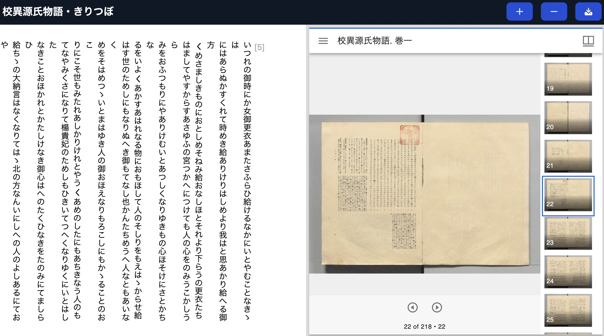

# TEI Viewer

 [](https://zenodo.org/badge/latestdoi/747989375)

TEI/XML Simple Viewer



Based on [CETEICean](https://teic.github.io/CETEIcean/), the text of TEI/XML is displayed. The 'n' attribute of the `pb` tag is shown. Additionally, images are displayed using the [Mirador](https://projectmirador.org/) viewer based on the URL of the IIIF manifest file provided in the `facsimile` tag.

## 🌐 Website

Visit the demo page to try it out.

<https://utda.github.io/tei-viewer/?u=https://kouigenjimonogatari.github.io/tei/01.xml&v=true>

## 📖 Parameter

| Field | Description                                   | Requirement |
| ----- | --------------------------------------------- | ----------- |
| u     | URL of TEI/XML File                           | required    |
| v     | If set to true, displays in vertical writing. | optional    |

## 📖 Getting Started

First, run the development server:

```bash
npm run dev
# or
yarn dev
# or
pnpm dev
# or
bun dev
```

Open [http://localhost:3000](http://localhost:3000) with your browser to see the result.

You can start editing the page by modifying `app/page.tsx`. The page auto-updates as you edit the file.

## 📖 Learn More

To learn more about Next.js, take a look at the following resources:

- [Next.js Documentation](https://nextjs.org/docs) - learn about Next.js features and API.
- [Learn Next.js](https://nextjs.org/learn) - an interactive Next.js tutorial.

You can check out [the Next.js GitHub repository](https://github.com/vercel/next.js/) - your feedback and contributions are welcome!

## Cite as

[](https://zenodo.org/badge/latestdoi/747989375)

The above DOI corresponds to the latest versioned release as [published to Zenodo](https://zenodo.org/records/10574443), where you will find all earlier releases. To cite `tei-viewer` independent of version, use https://doi.org/10.5281/zenodo.10574443, which will always redirect to the latest release.
